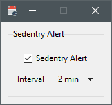

# Sedentary Alert
A small python application built with `tkinter` to send sedentary alerts in a fixed interval. During each interval try to shift your (eye) focus to something far away, blink your eyes, sit straight (or sit up and take a short walk if you can) and drink some water.

